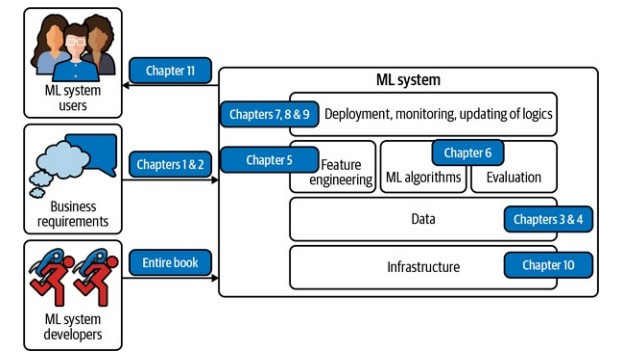

# Chapter 1: Overview of Machine Learning Systems

## Key Points

### 1. **The Growth of ML in Production**
   - ML's impact has expanded rapidly since successes like Google Translate’s multilingual system in 2016.
   - ML is now embedded in various aspects of daily life, with untapped potential in fields like healthcare and agriculture.

### 2. **Understanding ML Systems Beyond Algorithms**
   - A production ML system includes not just the model but also business requirements, user interfaces, data infrastructure, monitoring, and deployment pipelines.
   - MLOps, inspired by DevOps, provides tools and practices to deploy, monitor, and maintain ML in production.
   
   

### 3. **When to Use ML**
   - ML is suitable for tasks that involve learning complex patterns from data, making predictions, and handling unseen data with similar distributions to training data.
   - Ideal scenarios include repetitive tasks, low-cost error tolerance, large-scale problems, and environments with evolving patterns.
   - ML should be avoided if ethical issues, simpler solutions, or high costs outweigh the benefits.

   

### 4. **Popular ML Use Cases**
   - **Consumer Applications**: Recommender systems, predictive typing, facial recognition, and translation.
   - **Enterprise Applications**: Fraud detection, price optimization, demand forecasting, customer acquisition, and churn prediction.
   - **Healthcare**: Diagnosing diseases, patient monitoring, and assisting doctors with predictions.

### 5. **Differences Between ML in Research and Production**
   - Production ML systems must meet various stakeholder requirements and balance fast inference with low latency, rather than just optimizing for model performance.
   - Data in production is often messier, biased, and constantly changing, unlike static, clean datasets used in research.
   - Production demands fairness and interpretability, which are often overlooked in research environments.

### 6. **ML Systems vs. Traditional Software Engineering**
   - Unlike traditional software, ML systems integrate code, data, and model artifacts, leading to unique challenges like versioning, testing data, and maintaining performance with shifting data patterns.
   - Production ML systems need to handle large models, ensure interpretability, and monitor performance in complex, often opaque, ways.

## Conclusion
- ML in production is complex, involving more than just algorithms. Robust ML systems require end-to-end considerations, including data management, deployment, monitoring, and responsible AI practices.
- This book offers a framework to understand and build ML systems holistically, with a focus on real-world applications and system design.
