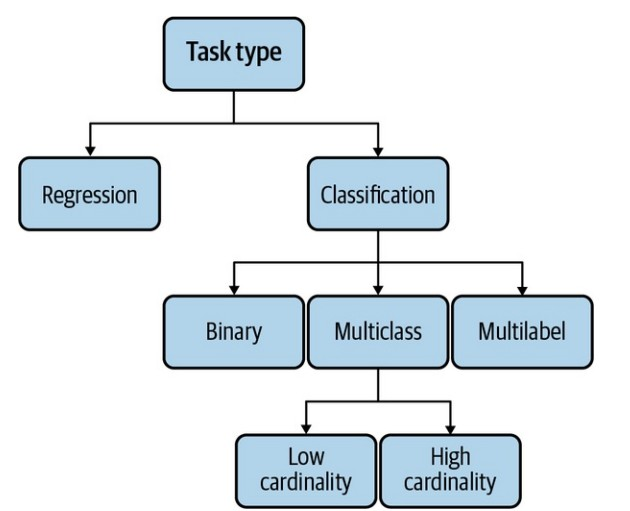

# Chapter 2: Introduction to Machine Learning Systems Design

## Key Points

### 1. **System Approach to ML Design**
   - ML systems design involves viewing ML holistically, ensuring all components—business objectives, data stack, infrastructure, deployment, and monitoring—align to meet both ML and business goals.
   - The focus is not only on the algorithm but on building an end-to-end system that functions seamlessly and reliably in production.

### 2. **Defining Business and ML Objectives**
   - Business objectives drive ML projects; ML metrics (like accuracy or latency) should ultimately support business goals like revenue, customer retention, or cost reduction.
   - Mapping ML performance to business outcomes can be complex and may require experimentation (e.g., A/B testing) to verify the impact of ML metrics on business metrics.

### 3. **Key Requirements for ML Systems**
   - ML systems typically need to meet four main requirements:
     - **Reliability**: Continues performing correctly under different conditions.
     - **Scalability**: Can handle increased model complexity, traffic, or number of models without bottlenecks.
     - **Maintainability**: Supports collaboration across diverse teams and tools, with versioning, reproducibility, and documentation.
     - **Adaptability**: Quickly adjusts to data shifts and new business needs.

### 4. **Iterative Development Process**
   - ML system development is iterative, involving constant cycles of project scoping, data engineering, model development, deployment, monitoring, and business analysis.
   - This iterative nature reflects the real-world dynamics of ML, where ongoing adjustments are essential to keep models relevant and effective.

### 5. **Framing ML Problems**
   - Proper problem framing is essential for effective ML solutions. Problems need to be framed in terms of inputs, outputs, and objective functions.
   - Common ML task types include:
     - **Classification vs. Regression**: Discrete category outputs vs. continuous values.
     - **Binary vs. Multiclass Classification**: Two classes (e.g., spam/not spam) vs. multiple classes (e.g., types of products).
     - **Multilabel Classification**: Instances can belong to multiple categories simultaneously.
  
     

### 6. **Objective Functions and Multi-Objective Design**
   - Objective functions, or loss functions, guide ML model training. Choosing the right objective is crucial to aligning model behavior with business goals.
   - Multi-objective ML tasks, such as ranking by both quality and engagement, can be handled by combining different objectives or using separate models for each goal to maintain flexibility and control.

### 7. **The Data vs. Model Debate**
   - There is an ongoing debate over the importance of large data sets versus intelligent algorithm design. 
   - Data-centric approaches, backed by industry leaders, argue that access to vast, high-quality data is key to ML success.
   - Despite differing views, both data quality and algorithm design remain essential, and most recent advancements rely on large data sets (e.g., GPT-3).

## Conclusion
- Effective ML systems start by aligning with business goals, establishing technical requirements, and using an iterative development approach.
- The book will delve deeper into each component, beginning with data engineering in the next chapter, as understanding data is critical to building successful ML systems.
